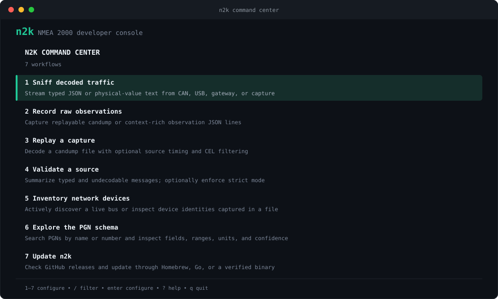

# [NMEA 2000](https://www.nmea.org/nmea-2000.html) for Humans and Agents

[](https://github.com/open-ships/n2k-cli/actions/workflows/test.yaml)
[](https://github.com/open-ships/n2k-cli/releases)


Decode, record, replay, validate, filter, and discover devices - with guided terminal workflows and scriptable commands.

Powered by the [`open-ships/n2k`](https://github.com/open-ships/n2k) Go library.

## Installation


```bash
curl -fsSL https://raw.githubusercontent.com/open-ships/n2k-cli/main/install.sh | sh
```


### Homebrew

On macOS or Linux:

```bash
brew install --cask open-ships/tap/n2k
n2k version
```

Homebrew upgrades are also available directly:

```bash
brew upgrade --cask open-ships/tap/n2k
```

## Why `n2k`?





### One tool for the whole debugging loop

| Use Case | Why use `n2k cli` |
|------|---------------------|
| Inspect traffic now | Decode SocketCAN, USB-CAN, TCP, UDP, candump, and gzip captures. |
| Reproduce a problem | Record owned observations, replay with original or disabled timing. |
| Reduce the firehose | Filter messages using [Common Expression Language](https://cel.dev/) and select typed, text, JSON, or unknown-PGN output. |
| Find devices | Actively discover a writable network or passively inventory a saved capture. |
| Measure decoder coverage | Validate a source, count undecodable PGNs, and fail CI in strict mode. |
| Understand a PGN | Autocomplete every known PGN and inspect fields, units, ranges, and confidence. |


## Rich terminal workflows

### Interactive command center

Launch the TUI:

```bash
n2k
```

The command center provides:

- Fuzzy command search with `/`, keyboard navigation, and numbered `1`–`7` shortcuts. Escape clears a palette filter before leaving.
- Guided source selection for SocketCAN, USB-CAN, TCP/UDP gateways, and files.
- Inline validation for paths, durations, addresses, formats, and PGNs.
- Tab completion for local capture paths, interfaces, gateway addresses, CEL
  filters, and durations; PGN search by name or number. Enter advances input fields.
- A reviewable, copyable command preview before anything runs, plus explicit
  confirmation before replacing an existing recording.
- Terminal-aware colors, compact layouts for small terminals, contextual key help,
  and a full-screen command palette that leaves the shell clean.
- Readable results, progress counts, saved-file confirmation, and retained settings
  for editing or retrying. Ctrl+C stops the running operation and saves captured data;
  the next-action menu lets you continue or quit.


Use `n2k tui --accessible` (or `N2K_ACCESSIBLE=1`) for screen-reader-friendly
prompts. In forms, Escape or Ctrl+C cancels configuration and returns to workflow
selection; Escape finishes or clears an active search first. Shift+Tab goes to
the previous field. In accessible mode, follow the numbered prompts and use
Ctrl+C to exit.

Try an offline inspection from a source checkout, without connecting hardware:

```bash
n2k sniff --file testdata/sample.log --output text --filter 'pgn == 128267'
n2k devices --file testdata/sample.log --output text
n2k pgn heading --output text
```

### Scriptable commands

The same workflows retain deterministic stdout and exit behavior:

```bash
# Yacht Devices WiFi gateway (RAW server mode) -- decoded JSON in one command
n2k sniff --tcp 192.168.4.1:1457

# Concrete Go PGN types with scaled physical values and SI units
n2k sniff --file capture.log --output text

# SocketCAN (Linux), USB-CAN serial, UDP, or capture replay
n2k sniff -i can0
n2k sniff -u /dev/ttyUSB0
n2k sniff --udp :1457
n2k sniff --file capture.log            # add --timing to replay at real speed
n2k sniff --file capture.log.gz         # gzip captures are expanded automatically

# CEL filtering, unknown PGNs, jq-friendly output
n2k sniff -i can0 -f 'pgn == 127250' --unknown | jq .

# Record, replay, validate, discover, and inspect schema support
n2k record -i can0 --out capture.log
# Existing files are protected; replace only when intended:
n2k record -i can0 --out capture.log --overwrite
n2k record --tcp 192.168.4.1:1457 --out observations.jsonl --output-format jsonl
n2k replay --timing=false capture.log
n2k validate --file capture.log --strict
n2k devices --tcp 192.168.4.1:1457 --wait 5s
n2k devices --file capture.log.gz
n2k devices list --file capture.log.gz  # "list" is an optional, readable alias
n2k pgn 127250
n2k pgn 127250 --output text
n2k pgn heading --output text
n2k pgn list | jq 'select(.complete == true)'
```

| Command | Functionality |
|---------|---------------|
| `n2k` / `n2k tui` | Open the searchable command palette and guided workflow forms. |
| `n2k sniff` | Decode live or recorded traffic into typed JSON lines or concrete PGN text with physical values. |
| `n2k record` | Capture replayable candump or owned observation JSON lines. |
| `n2k replay` | Replay and decode a candump capture, optionally preserving its original timing. |
| `n2k validate` | Count typed and undecodable messages by PGN and optionally fail in strict mode. |
| `n2k devices` | Actively discover a writable bus or passively inventory devices observed in a capture/UDP stream. |
| `n2k pgn` | Query or list typed PGN metadata, fields, ranges, and confidence. |
| `n2k update` | Check for a release and update through Homebrew, Go, or a verified release binary. |
| `n2k uninstall` | Remove n2k and its update-check cache from the machine. |

Run `n2k help <command>` for organized flags, defaults, allowed values, and
examples. The purpose-built parser enforces canonical `--long-flags`, supports
`--flag=value`, validates choices before starting I/O, and suggests the nearest
command or flag after a typo.

`devices` accepts the same source vocabulary as the other inspection commands.
SocketCAN, USB, and TCP sources perform active discovery; files are scanned to
completion; UDP is observed for `--wait`. Both `n2k devices --file …` and the
more conversational `n2k devices list --file …` are valid. Capture files may
be plain candump text or gzip-compressed.

### Updates

Check for and install the latest release:

```bash
n2k update
```

Useful controls:

```bash
n2k update --check             # report only; do not install
n2k update --force             # reinstall the latest release
n2k update --method homebrew   # override: homebrew, go, or binary
```

The interactive command center checks for updates at most once every 24 hours
and offers to install them before opening. Set `N2K_AUTO_UPDATE=1` to install
without the confirmation prompt, or `N2K_NO_UPDATE_CHECK=1` to disable the
automatic check. Scriptable commands never perform implicit network requests or
updates.

### Uninstall

Remove n2k and its update-check cache:

```bash
n2k uninstall
```

### Shell completion

Enable completion for the current shell with one of:

```bash
source <(n2k completion bash)                              # Bash
source <(n2k completion zsh)                               # Zsh
n2k completion fish | source                              # Fish
n2k completion powershell | Out-String | Invoke-Expression # PowerShell
```

Completion is dynamic rather than a static command list. It understands:

- Commands and unused flags, with descriptions.
- Source and output paths, including directory traversal.
- Stream, message, and capture formats.
- SocketCAN interface names, common gateway addresses, and Go durations.
- CEL filter examples.
- Every known PGN number with its description.

### Output

`sniff` and `replay` default to JSON lines containing typed structs and their
exact wire values. The demo projects the metadata envelope down to its PGN for
readability. Set `--output text` for the concrete `pgn.<Type>`, source address,
scaled physical values, SI units, and labels for common marine enumerations
(with numeric fallbacks for other lookups).

`record` writes replayable candump by default. Existing destinations require
`--overwrite`; an input capture cannot also be the output, including through
symlinks or hard links. The wizard suggests a fresh filename and asks before
replacement. JSONL is a detailed export and cannot currently be replayed by n2k.
Empty files and unsupported capture formats produce actionable errors.

`devices`, `validate`, and `pgn` accept `--output text` for readable tables and
summaries. The guided workflows default to readable output; scriptable commands
keep JSON as their default. Validation JSON includes `undecodableByPgn`, and its
text summary identifies the failing PGNs with an inspection command.

In JSON-lines mode, `record` retains each
owned source observation, including adapter and network identity, source and
receipt timestamps, gateway-relative time, direction, and frame bytes. The Go
library's observation stream additionally exposes assembled messages and
decode errors.

## Development

Go 1.26.6 or newer and `just` are required.

```bash
just setup # first checkout only
just test
just lint
just secure
```

Releases follow semantic versioning. [`VERSION`](VERSION) declares the release
baseline, and fully green release automation publishes the tag and prebuilt
binaries. GoReleaser builds remain project-owned, while the exact-version-tagged
shared Open Ships release policy publishes checksums, an SBOM, toolchain
evidence, and separate build-provenance and SBOM attestations for the platform
archives.

## License

MIT — see [LICENSE](LICENSE).
