# n2k-cli

[](https://github.com/open-ships/n2k-cli/actions/workflows/test.yaml)
[](https://github.com/open-ships/n2k-cli/releases)

`n2k-cli` provides the `n2k` command-line interface for NMEA 2000 (N2K), the
CAN-based network that connects marine instruments such as GPS, depth, wind,
engine, and autopilot systems. It decodes, records, replays, validates, and
inspects traffic from CAN hardware, USB-CAN adapters, WiFi gateways, and
capture files.

Run `n2k` without arguments for a searchable Bubble Tea command center with
guided, autocomplete-enabled workflows. Every operation also remains available
as a stable, non-interactive subcommand for scripts and JSON pipelines.

The CLI is powered by the
[`open-ships/n2k`](https://github.com/open-ships/n2k) Go library.



## Quick Start — No Boat Required

The repository bundles a real six-second capture from a sailing vessel, so the
first run works at a desk:

```bash
git clone https://github.com/open-ships/n2k-cli && cd n2k-cli
go run ./cmd/n2k sniff --file testdata/sample.log | jq .
```

Frames carrying vessel position, routes, or identity were removed from the
sample for privacy.

## Install

Install the latest release with Homebrew:

```bash
brew install --cask open-ships/tap/n2k
```

Or install it directly with Go:

```bash
go install github.com/open-ships/n2k-cli/cmd/n2k@latest
```

Go writes the binary to `GOBIN`, which defaults to `$(go env GOPATH)/bin`;
that directory must be on `PATH`.

Prebuilt binaries for Linux, macOS, and Windows are available on the
[`n2k-cli` releases page](https://github.com/open-ships/n2k-cli/releases).

To build the CLI from a checkout:

```bash
just build       # writes bin/n2k
./bin/n2k --help
just install     # optional: installs n2k into Go's bin directory
```

## The `n2k` CLI

### Interactive command center

Launch the TUI:

```bash
n2k
```

The command center provides:

- Fuzzy command search with `/`, keyboard navigation, and `1`–`7` shortcuts.
- Guided source selection for SocketCAN, USB-CAN, TCP/UDP gateways, and files.
- Inline validation for paths, durations, addresses, formats, and PGNs.
- Tab-completable capture paths, common interfaces, gateway addresses, CEL
  filters, durations, and every known PGN number.
- A reviewable, copyable command preview before anything runs.
- Terminal-aware colors, contextual key help, cancellation, and a full-screen
  alternate buffer that leaves the shell clean.

For screen readers or terminals that cannot redraw reliably, use accessible
prompts:

```bash
n2k tui --accessible
# Or persist the preference:
export N2K_ACCESSIBLE=1
```

### Scriptable commands

The same workflows retain deterministic stdout and exit behavior:

```bash
# Yacht Devices WiFi gateway (RAW server mode) -- decoded JSON in one command
n2k sniff --tcp 192.168.4.1:1457

# Concrete Go PGN types with scaled physical values and SI units
n2k sniff --file capture.log --output text

# SocketCAN (Linux), USB-CAN serial, UDP, or capture replay
n2k sniff -i can0
n2k sniff -u /dev/ttyUSB0
n2k sniff --udp :1457
n2k sniff --file capture.log            # add --timing to replay at real speed
n2k sniff --file capture.log.gz         # gzip captures are expanded automatically

# CEL filtering, unknown PGNs, jq-friendly output
n2k sniff -i can0 -f 'pgn == 127250' --unknown | jq .

# Record, replay, validate, discover, and inspect schema support
n2k record -i can0 --out capture.log
n2k record --tcp 192.168.4.1:1457 --out observations.jsonl --output-format jsonl
n2k replay --timing=false capture.log
n2k validate --file capture.log --strict
n2k devices --tcp 192.168.4.1:1457 --wait 5s
n2k devices --file capture.log.gz
n2k devices list --file capture.log.gz  # "list" is an optional, readable alias
n2k pgn 127250
n2k pgn list | jq 'select(.complete == true)'
```

| Command | Functionality |
|---------|---------------|
| `n2k` / `n2k tui` | Open the searchable command palette and guided workflow forms. |
| `n2k sniff` | Decode live or recorded traffic into typed JSON lines or concrete PGN text with physical values. |
| `n2k record` | Capture replayable candump or owned observation JSON lines. |
| `n2k replay` | Replay and decode a candump capture, optionally preserving its original timing. |
| `n2k validate` | Count typed and undecodable messages by PGN and optionally fail in strict mode. |
| `n2k devices` | Actively discover a writable bus or passively inventory devices observed in a capture/UDP stream. |
| `n2k pgn` | Query or list typed PGN metadata, fields, ranges, and confidence. |
| `n2k update` | Check for a release and update through Homebrew, Go, or a verified release binary. |

Run `n2k help <command>` for organized flags, defaults, allowed values, and
examples. The purpose-built parser enforces canonical `--long-flags`, supports
`--flag=value`, validates choices before starting I/O, and suggests the nearest
command or flag after a typo.

`devices` accepts the same source vocabulary as the other inspection commands.
SocketCAN, USB, and TCP sources perform active discovery; files are scanned to
completion; UDP is observed for `--wait`. Both `n2k devices --file …` and the
more conversational `n2k devices list --file …` are valid. Capture files may
be plain candump text or gzip-compressed.

### Updates

Check for and install the latest release:

```bash
n2k update
```

The updater preserves the installation method:

- Homebrew installations run `brew upgrade --cask open-ships/tap/n2k`.
- Go installations run `go install` against the exact latest release tag.
- Downloaded release binaries are replaced atomically after their archive
  matches the release's `checksums.txt`.

Useful controls:

```bash
n2k update --check             # report only; do not install
n2k update --force             # reinstall the latest release
n2k update --method homebrew   # override: homebrew, go, or binary
```

The interactive command center checks for updates at most once every 24 hours
and offers to install them before opening. Set `N2K_AUTO_UPDATE=1` to install
without the confirmation prompt, or `N2K_NO_UPDATE_CHECK=1` to disable the
automatic check. Scriptable commands never perform implicit network requests or
updates.

### Shell completion

Enable completion for the current shell with one of:

```bash
source <(n2k completion bash)                              # Bash
source <(n2k completion zsh)                               # Zsh
n2k completion fish | source                              # Fish
n2k completion powershell | Out-String | Invoke-Expression # PowerShell
```

Completion is dynamic rather than a static command list. It understands:

- Commands and unused flags, with descriptions.
- Source and output paths, including directory traversal.
- Stream, message, and capture formats.
- SocketCAN interface names, common gateway addresses, and Go durations.
- CEL filter examples.
- Every known PGN number with its description.

### Output

`sniff` and `replay` default to JSON lines containing typed structs and their
exact wire values. The demo projects the metadata envelope down to its PGN for
readability. Set `--output text` for the concrete `pgn.<Type>`, source address,
scaled physical values, SI units, and lookup type names.

`record` writes replayable candump by default. JSON-lines mode retains each
owned source observation, including adapter and network identity, source and
receipt timestamps, gateway-relative time, direction, and frame bytes. The Go
library's observation stream additionally exposes assembled messages and
decode errors.

## Development

Go 1.25.8 or newer and `just` are required.

```bash
just setup # first checkout only
just test
just lint
just secure
```

Releases follow semantic versioning. [`VERSION`](VERSION) declares the release
baseline, and fully green release automation publishes the tag and prebuilt
binaries.

## License

MIT — see [LICENSE](LICENSE).
